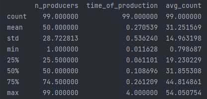
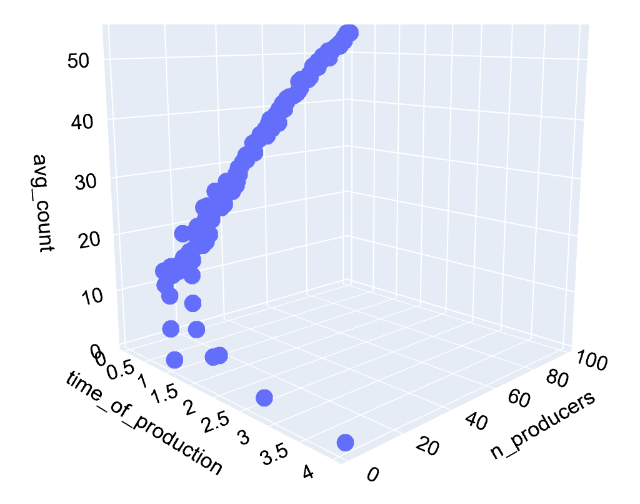
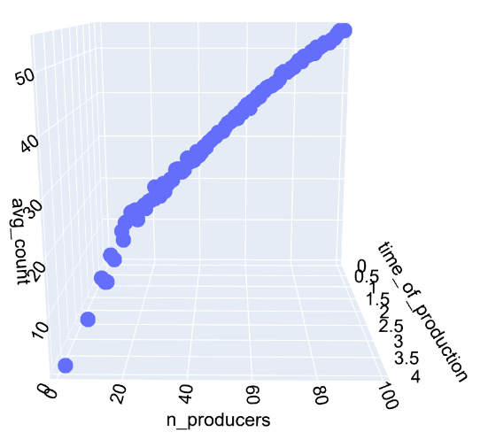
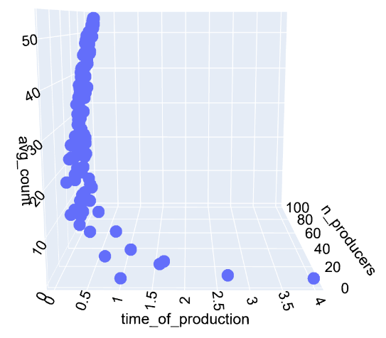

# Assignment 3

> Producers and Consumers

In our project we worked on Task 1 - Producers and consumers.
Experiment consisted from changing parameters that were used by Producer function.

In for cycle were parametes of production changing. We used 99 diferent parameters
and overall time of production (time that main thread was sleeping) was 5 seconds. 

___

Parameters we changed:
1. Number of Producers `(1...100)` - increasing
2. Number of Consumers `(1...100)` - increasing
3. Time of production `(randint(1,10)) / 1...100` - decreasing

___

Result that shows how good parameters were was count of produced item in time.
Steps of measurement:

1. Start timer
2. Call producer function with given parameters
3. increase `count` variable every time new item was produced
4. Stop timer after return to main Thread
5. Divide items count by elapsed time

These steps were used 10 times and final count of items for parameters
was average to get more consistent results.

## Result

We saved data to `out.csv` for better visualisation. To get data from file we used **pandas** 
library and to visualisation **plotly** library. We did not store count of Consumers, because it is
all the time the same as number of Producers.

When we use `describe()` function from pandas, you can see important information about data.

  

As main visualisation we used **Scatter graph**. Here you can see whole graph 
and how all 3 variables collide together.

  

In this example u can see dependability of producers count and result count of items produced.
It is obvious that when we increase number of producers, number of items increases as well.

  

In this example u can see dependability of production time and result count of items produced.
With smaller production time, producers can create more items. 

  

## Conclusion
Results of experiment were same as predicted. With increased number of Producers and decreased 
time needed to produce item. Number of items is increased as well. 
